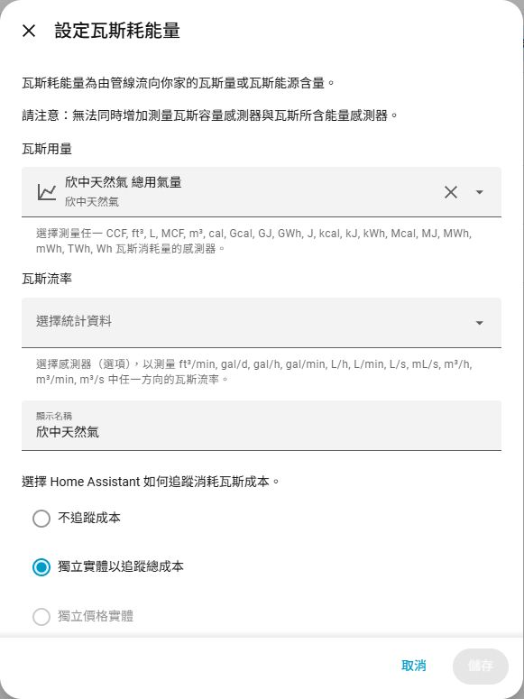
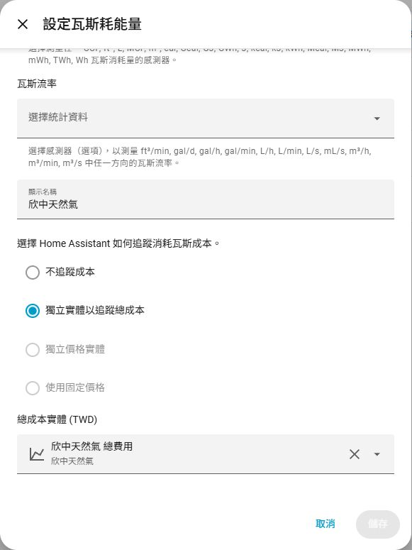

# HACS - 欣中天然氣帳單匯入

在 Home Assistant 查詢欣中天然氣帳單、用氣量與費用。填入用戶號碼及戶名即可使用。

非欣中天然氣官方整合，適用欣中天然氣用戶。

[完整使用指南](docs/usage.md) · [爬蟲排程與狀態](docs/live-check.md) · [更新紀錄](CHANGELOG.md)

## 功能

- 帳單明細、用氣量、抄表讀值、費用、繳費狀態與歷史紀錄。
- 自動排程、立即查詢最新一期、補抓歷史與重建統計按鈕。
- 上次／下次查詢時間、查詢結果與統計狀態。
- 能源面板可用的「欣中天然氣 總用氣量」與費用統計，無須自建 helper 或 YAML。
- 支援多帳戶及自訂顯示名稱；查詢失敗保留已保存帳單。

## 安裝

需要 **Home Assistant 2026.9.1 以上**。

**HACS**

1. 先安裝 HACS，點頁首按鈕開啟儲存庫；也可在 HACS「自訂儲存庫」加入 `https://github.com/yitsewu/shin-chung-gas`，類型選「整合」。
2. 下載整合，重新啟動 Home Assistant。

**ZIP 安裝**

1. 從 [Releases](https://github.com/yitsewu/shin-chung-gas/releases) 下載 `scgas.zip`。
2. 將內容解壓至 HA 的 `/config/custom_components/scgas/`，確認 `manifest.json` 位於該目錄內，重新啟動 HA。

更新前先備份 HA。

## 設定

1. 前往「設定 → 裝置與服務 → 新增整合」，搜尋「欣中天然氣」。
2. 填入帳單上的六碼用戶號碼與戶名，可自訂顯示名稱。首次預設取得官網可提供的全部帳期。
3. 在整合選項調整查詢排程；預設每週一 09:00。
4. 等待「長期統計狀態」顯示完成，在能源面板的天然氣設定選擇「欣中天然氣 總用氣量」及對應的「欣中天然氣 總費用」。若有自訂顯示名稱，請選擇對應名稱的統計。

## 匯入能源面板

先等待欣中整合的「長期統計狀態」顯示「已完成」，再開啟 **能源 → 編輯主面板 → 瓦斯 → 增加瓦斯來源**。

| ① 選擇用氣量 | ② 加入費用 |
| :--- | :--- |
| 「瓦斯用量」選 **欣中天然氣 總用氣量**；「瓦斯流率」留空，顯示名稱填 **欣中天然氣**。 | 往下捲動，選 **獨立實體以追蹤總成本**；總成本選 **欣中天然氣 總費用**，按「儲存」。 |
|  |  |

新增或修改選項後即可儲存。若有自訂裝置名稱，請選擇對應名稱的統計。

**3. 查看結果**

回到 **能源 → 瓦斯**，即可查看用氣量及費用。選擇有帳單資料的月份或年份；新來源最多可能需要 2 小時才顯示。圖表依帳單期間分攤估算，並非即時用氣量。

## 自動爬蟲排程

| 用途 | 執行位置 | 頻率與內容 |
| --- | --- | --- |
| 自動匯入自己的帳單 | Home Assistant | 預設每週一 09:00；可改每日、每週或每月，依 HA 時區執行，更新所選歷史範圍及統計 |
| 公開相容性檢查 | GitHub Actions | 每 6 小時，台灣時間 02:41、08:41、14:41、20:41；檢查最新正式版爬蟲，不寫入 HA |

在整合選項設定時間與頻率，或使用「自動查詢」開關暫停 HA 排程。手動查詢不會延後下一次固定排程。每月日期超過當月天數時，改在月底執行。HA 關機期間不會執行查詢，重啟後恢復下一個時間點；詳細選項與查詢紀錄見[使用指南](docs/usage.md#自動排程)。GitHub 排程可能延遲，不能用作準時繳費提醒。

## 帳單內容

| 資料 | 說明 |
| --- | --- |
| 使用度數／抄表度 | 本期用氣 m³／累積抄表讀值，兩者不同 |
| 計費期間／應收日期 | 保留官網起迄日；帳期以應收日期的月份識別 |
| 費用明細 | 從量費、表／開關租金、追收、退還、基本費、違約金與合計；總費用直接採官網合計 |
| 繳費狀態／期限 | 保留已銷帳或未銷帳結果；官網省略期限時顯示未知，不猜測日期 |
| 分攤與年度摘要 | 每月用氣、費用、可選碳排估算，以及已涵蓋月份；不代表完整年度實測 |

官網一次回傳可查帳單列表，整合再選取最新一期、指定帳期或歷史上限。原站後來移除可查帳期時，已保存歷史仍保留；重新抓歷史會更新所選帳單的費用與銷帳修正。

## 月度分攤

預設按帳單涵蓋月份平均分配。例如兩個月一期 **20 度、600 元 → 每月 10 度、300 元**；其他帳期依實際涵蓋月份分配。

這是**帳單分攤估算，不是每月實際抄表量**。整合選項可改為按實際天數分攤，也可按「重建長期統計」重新整理已保存的帳單。

需要碳排估算時，可自行設定碳排係數與來源；未設定時顯示未知。

## 操作與故障排除

- 「立即查詢最新一期」：重新查官網，更新最新帳單。
- 「補抓歷史帳單」：依歷史上限更新官網仍可查的帳期；上限 `0` 為全部。
- 「重建長期統計」：使用已保存帳單重新計算，不查官網。
- 查詢失敗時先看錯誤代碼與最後成功時間；能源資料未更新時另看「長期統計狀態」。查詢成功不等於統計寫入完成。

完整的選項、Actions 範例、估算方法、錯誤代碼、備份與移除方式見[使用指南](docs/usage.md)。

## 資料來源

資料來自欣中天然氣的[氣費查詢網站](https://www.scgas.com.tw:3001/MobileType_3_1)。本整合使用填入的用戶號碼與戶名，取得「瓦斯費用暨度數明細資料」，再整理為 Home Assistant 的用氣量、費用與歷史統計。

## 問題回報

回報問題請到 [Issues](https://github.com/yitsewu/shin-chung-gas/issues)，勿附上用戶號碼、戶名或原始帳單。

## 授權

程式碼採用 [MIT License](LICENSE)。
